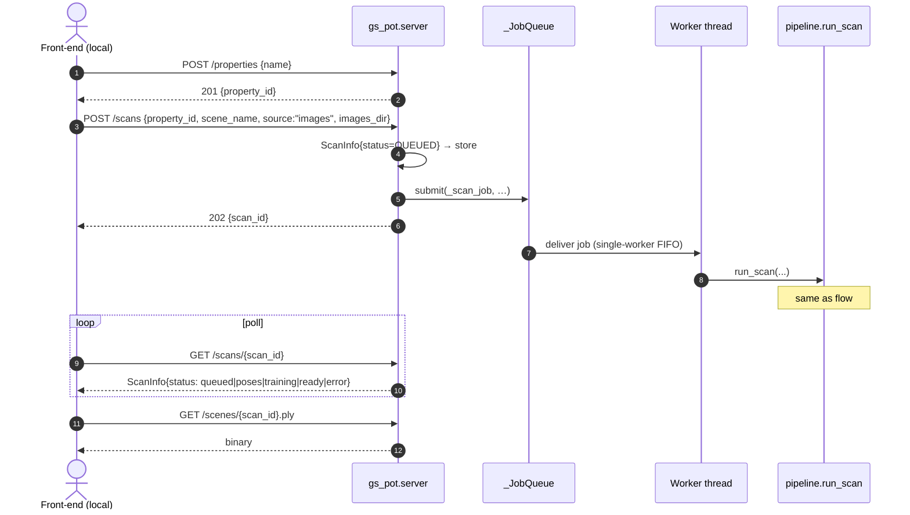
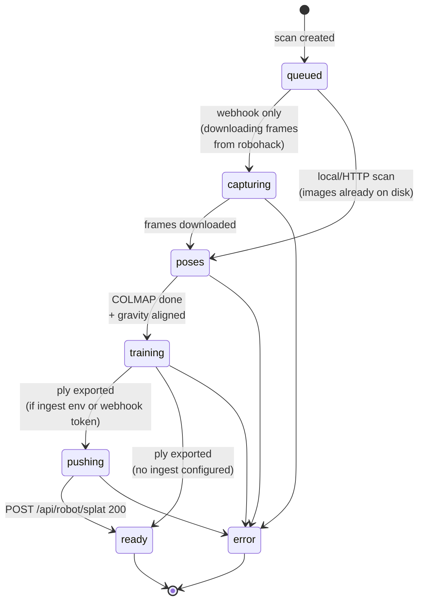

# Flows

How `gs-pot` is driven end-to-end. Three flavors:

1. [Local CLI scan](#1-local-cli-scan-phone-photos--ply) — your laptop, phone
   photos, no robot, no robohack.
2. [Direct HTTP scan](#2-direct-http-scan-images_dir-on-our-server) — same
   pipeline, called over HTTP by something already on the Mac.
3. [Production webhook](#3-production-webhook-robohack--ngrok--gs-pot) — the
   real flow: robohack front-end → ngrok → gs-pot → splat back to robohack.

The pipeline itself (COLMAP → train → push) is identical across all three —
only the *trigger* and *image source* differ.

---

## 1. Local CLI scan (phone photos → `.ply`)

```mermaid
sequenceDiagram
    autonumber
    actor U as You
    participant Sh as scan-room.sh
    participant CLI as python -m gs_pot
    participant Pipe as pipeline.run_scan
    participant Col as poses.run_colmap<br/>(pycolmap)
    participant Brush as bin/brush
    participant FS as scenes/&lt;scan_id&gt;/

    U->>Sh: ./scripts/scan-room.sh bathroom "My Apt"
    Sh->>Sh: HEIC→JPG (sips/ffmpeg, skipped if none)
    Sh->>Sh: EXIF auto-orient (PIL ImageOps)
    Sh->>Sh: count images, fail if 0
    Sh->>CLI: exec uv run python -m gs_pot scan ...
    CLI->>CLI: auto-create in-process Property
    CLI->>CLI: ScanInfo{status=QUEUED} → store
    CLI->>Pipe: run_scan(scan_id, images_dir, …)

    Pipe->>Col: extract_features → match_exhaustive → mapper
    Col->>FS: write sparse/0/{cameras,images,points3D}.bin
    Col->>Col: _align_to_gravity (rotate cameras' mean down → -Y)
    Col-->>Pipe: sparse model path

    Pipe->>Brush: brush &lt;workspace&gt; --total-steps N --export-name scene.ply
    Brush->>FS: scene.ply
    Brush-->>Pipe: ply path

    Note over Pipe: GS_POT_INGEST_URL unset → skip push

    Pipe->>FS: thumb.jpg (first image, 512px)
    Pipe-->>CLI: ScanInfo{status=READY}
    CLI->>U: ✓ DONE + summary table + viewer URL
```

---

## 2. Direct HTTP scan (`images_dir` on our server)

The teammate's front-end (when they're testing on the Mac itself) can hit
gs-pot's `POST /scans` with an `images_dir` already on the local filesystem.



---

## 3. Production webhook (robohack → ngrok → gs-pot)

The user starts a capture session in robohack's web UI; the robot streams
frames to robohack's S3-backed ingest; user clicks "End run"; robohack's
front-end posts to *our* ngrok URL; we pull the frames, train, and POST the
finished `.ply` back to robohack.

```mermaid
sequenceDiagram
    autonumber
    actor U as User
    participant Web as robohack apps/web
    participant Go2 as Go2 + DimOS
    participant RH as robohack apps/server<br/>(S3 + Postgres)
    participant NG as ngrok<br/>(twilight-…-possum.ngrok-free.dev)
    participant Srv as gs-pot.server (Mac)
    participant Q as _JobQueue
    participant Pipe as pipeline.run_scan

    U->>Web: Start run
    Web->>Web: run_id = uuid()
    Web->>Go2: capture loop {run_id, positions[], angles[]}
    loop each (position, angle)
        Go2->>RH: POST /api/robot/frame<br/>multipart: file, run, position, angle  (Bearer)
        RH->>RH: S3 put + frames row
        RH-->>Go2: 200 {key}
    end

    U->>Web: End run
    Web->>NG: POST /api/runs/{run_id}/process<br/>{robohack_base, ingest_token, trainer?, steps?, quality?}
    NG->>Srv: forwards to :8000
    Srv->>Srv: auto-create Property "run:&lt;run_id&gt;"
    Srv->>Srv: ScanInfo{status=QUEUED} → store
    Srv->>Q: submit(_process_run_job, …)
    Srv-->>Web: 202 {scan_id, queue_depth}

    Q->>Srv: deliver (when worker free)
    Srv->>Srv: status → CAPTURING

    Srv->>RH: GET /api/scans/{run_id}
    RH-->>Srv: {scans: [{positions: [{images: [{url, …}, …]}]}]}<br/>presigned S3, 6h TTL

    loop each frame
        Srv->>RH: GET &lt;presigned url&gt;
        RH-->>Srv: image bytes → scenes/&lt;scan_id&gt;/images_src/
    end

    Srv->>Pipe: run_scan(... ingest_url, ingest_token)
    Note over Pipe: COLMAP → gravity-align → Brush → thumb
    Pipe->>RH: POST /api/robot/splat<br/>Bearer &lt;ingest_token&gt;  multipart: file, format=ply, name="run:&lt;run_id&gt;"
    RH-->>Pipe: 200 {id, key}
    Pipe-->>Srv: ScanInfo{ingest_id, ingest_key, status=READY}

    loop poll (optional)
        Web->>NG: GET /scans/{scan_id}
        NG->>Srv: forwards
        Srv-->>Web: ScanInfo with status & ingest_id
    end

    U->>Web: open /scans page
    Web->>RH: GET /api/scans
    RH-->>Web: runs grouped tree, now including the new splat
    Web->>Web: Spark renders splat alongside frames
```

---

## Scan status state machine

Every scan ID goes through the same lifecycle, regardless of trigger:



---

## Where the splat lives

After a scan reaches `ready`, the `.ply` is in *all three places* if the
webhook flow ran:

| Location | URL | Reader |
|---|---|---|
| Local disk | `scenes/<scan_id>/scene.ply` | anything |
| gs-pot HTTP | `https://<ngrok>/scenes/<scan_id>.ply` (or `localhost:8000`) | our `web/` viewer, debugging |
| Robohack S3 | `splats/<robohack_id>.ply` (via their oRPC `splats.list` + presignGet) | robohack's `apps/web` Spark viewer |

For demos, the robohack viewer is canonical — the local one is a smoke-test.

---

## ngrok one-liner (for the webhook flow)

```bash
# terminal 1
./scripts/dev.sh

# terminal 2
ngrok http --url=https://twilight-getting-possum.ngrok-free.dev 8000

# front-end config (in robohack)
GS_POT_URL=https://twilight-getting-possum.ngrok-free.dev
```

On "End run" the front-end fires:

```
POST https://twilight-getting-possum.ngrok-free.dev/api/runs/<run_id>/process
Content-Type: application/json

{
  "robohack_base": "https://<your-robohack-server>",
  "ingest_token": "<ROBOT_INGEST_TOKEN from robohack/apps/server/.env>",
  "trainer": "brush",
  "steps": 2000,
  "quality": "low"
}
```
